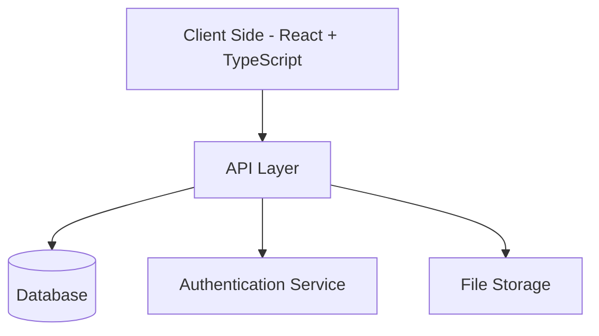
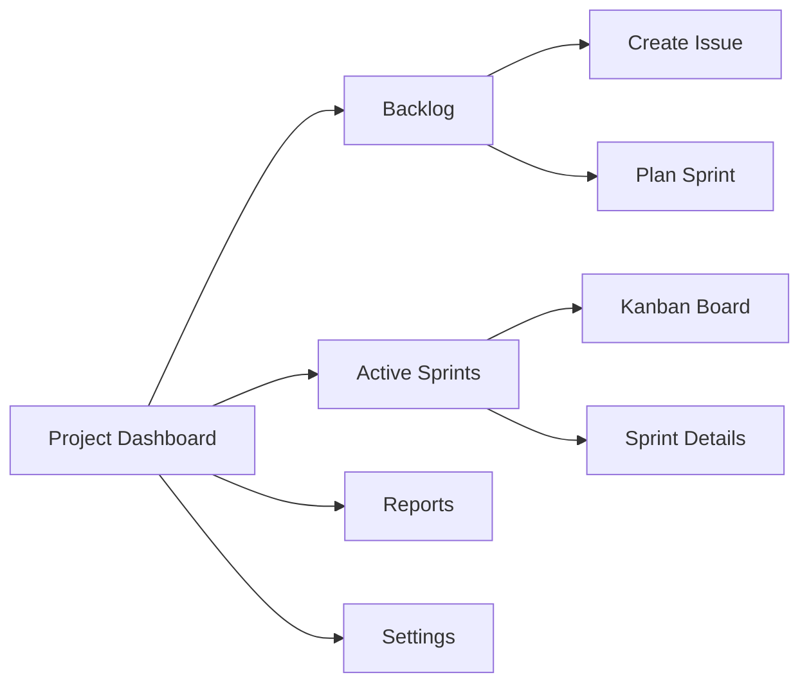
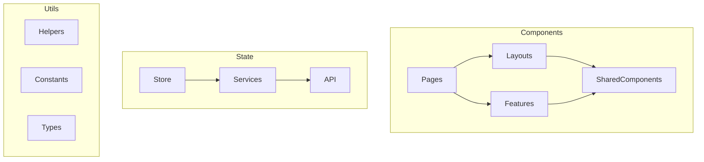
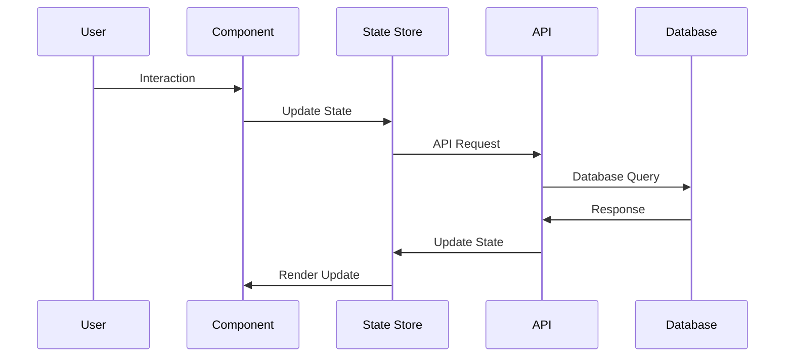

# Project Management Web Application Architecture

## 1. System Architecture

## 2. Core Features and Components

### A. Authentication & Authorization

- User authentication (Login/Register)
- Role-based access control (Admin, User)
- Team-based permissions

### B. Project Management

1. **Projects**

   - Project creation and configuration
   - Team management
   - Project settings and customization

2. **Issues & Tasks**

   - Issue creation and management
   - Custom fields
   - Attachments
   - Comments and discussions

3. **Agile Tools**
   - Backlog management
   - Sprint planning
   - Kanban boards
   - Roadmap view

### C. Core Features

## 3. Technical Architecture

### Frontend Architecture

### Data Flow

## 4. Implementation Plan

### Phase 1: Core Infrastructure

1. Project setup and configuration
2. Authentication system
3. Basic project management features
4. Database schema implementation

### Phase 2: Project Management Features

1. Issue tracking system
2. Sprint management
3. Kanban board implementation
4. Team collaboration features

### Phase 3: Advanced Features

1. Reporting and analytics
2. Integration capabilities
3. Advanced customization options
4. Performance optimization

## 5. Technology Stack

1. **Frontend**

   - React + TypeScript
   - Tailwind CSS for styling
   - React Query for data fetching
   - Redux Toolkit for state management
   - React Router for navigation

2. **Backend**

   - Node.js with Express/NestJS
   - PostgreSQL for database
   - Redis for caching
   - JWT for authentication

3. **Infrastructure**
   - Docker for containerization
   - CI/CD pipeline
   - Cloud storage for attachments
   - WebSocket for real-time updates
